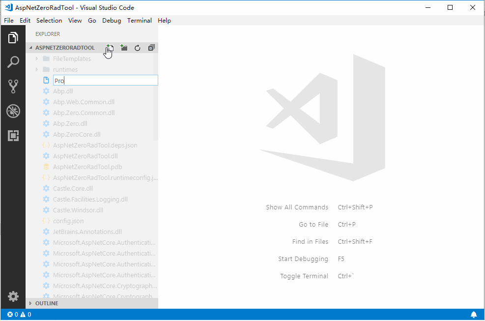

# Asp.Net Zero rad tool for vscode 

## Description

aspnet zero rad tool is a VS Code extension which lets you create an entity and its corresponding layers from the database to the user interface. So, you can create a fully working, production ready CRUD page in seconds.

It is similar with the official visual studio extension: [ASP.NET Zero Power Tools](https://marketplace.visualstudio.com/items?itemName=Volosoft.AspNetZeroPowerTools)

## Usage

1. new a YourEntity.json file in the `aspnet-core\AspNetZeroRadTool` folder
2. using code snippets to edit YourEntity.json file
3. run the command `Run ASP.NET Zero Rad Tool` from explore context menu

## Available Snippets

* zero-entity
* zero-property
* zero-nav-property
* zero-enum-def

## Fields of entity json

please refs aspnet zero document [https://docs.aspnetzero.com/documents/zero/latest/Development-Guide-Rad-Tool-Mac-Linux](https://docs.aspnetzero.com/documents/zero/latest/Development-Guide-Rad-Tool-Mac-Linux)

**Enjoy!**
